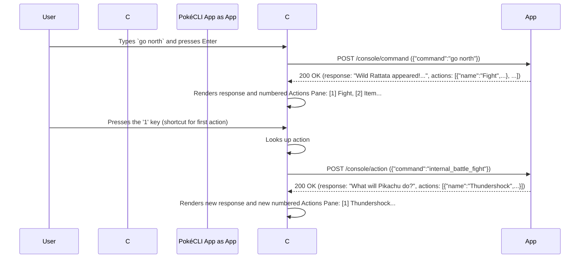
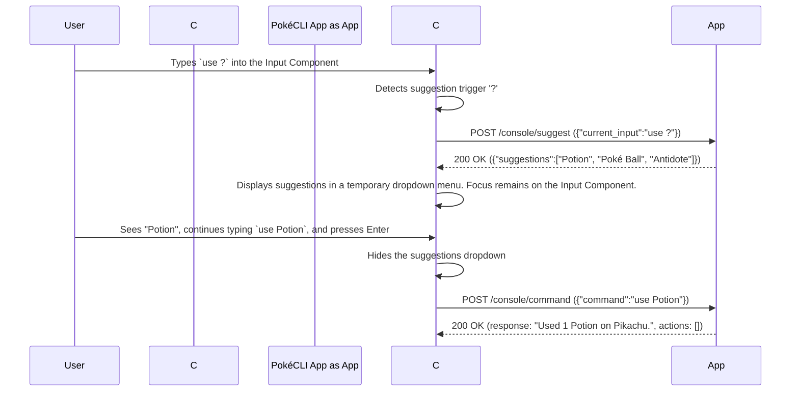

# Universal Application Console: Design Specification v1.2

## 1. Vision & Abstract

This document specifies the design for the **Universal Application Console** system. The system provides a generic, rich, terminal-based user interface (the **Console**) for interacting with any backend application that adheres to a defined communication standard (the **Compliance Protocol**).

The core paradigm is one of decoupling. The Console is analogous to a video game console; it provides a standardized controller and display. A **Compliant Application** is analogous to a game cartridge; it provides the logic and content. The user can use the same Console to "play" any Compliant Application, receiving a consistent, high-quality interactive experience regardless of the application's underlying technology.

## 2. Core Concepts & Terminology

*   **The Console:** The client-side Terminal User Interface (TUI) application. This is a single, standalone binary written in Go. Its sole responsibility is to render the UI, manage user input, and communicate with a Compliant Application via the protocol. The Console is entirely stateless regarding application logic. It is inspired by the clean, reactive, and helpful Claude Code interface.
*   **The Compliant Application (The Application):** Any backend program, service, or script that correctly implements the Compliance Protocol. It is the "server" in the client-server relationship and the single source of truth for all application state and logic. It can be written in any language capable of running an HTTP server.
*   **The Compliance Protocol v1.2:** The rigid, versioned contract that defines how the Console and the Application communicate. It is an HTTP-based protocol utilizing JSON payloads. Adherence to this protocol is mandatory for an application to be considered "compliant."

## 3. Component Specification: The Console

### 3.1. Purpose and Technology Stack

*   **Purpose:** To provide a universal, interactive front-end for any compliant backend application.
*   **Language:** Go
*   **Core TUI Framework:** [Bubble Tea](https://github.com/charmbracelet/bubbletea)
*   **Styling & Layout:** [Lipgloss](https://github.com/charmbracelet/lipgloss)
*   **TUI Components:** [Bubbles](https://github.com/charmbracelet/bubbles)

### 3.2. User Interface (UI) Layout and Focus Model

The Console UI prioritizes a clean, conversational flow. The key concept is **UI Focus**, which determines what part of the UI is currently active. The user can cycle focus between the **Input Component** and the **Actions Pane** (when visible), typically using the `Tab` key.

```
+--------------------------------------------------------------------------+
| [PokéCLI Adventure v0.1.0] - Connected to localhost:8080                 |
+--------------------------------------------------------------------------+
|                                                                          |
|  YOU> go north                                                           |
|  APP> You are on Route 1. A wild Rattata appeared!                       |
|       Wild Rattata | LVL: 3 | HP: [██████████] 13/13                     |
|       Pikachu      | LVL: 7 | HP: [████████--] 22/25                     |
|                                                                          |
| | [1] Fight                                                              |
| | >[2] Item<                                                             |
| | [3] Pokémon                                                            |
| | [4] Run                                                                |
|                                                                          |
| +----------------------------------------------------------------------+ |
| | Input Box                                                            | |
| +----------------------------------------------------------------------+ |
| (? for shortcuts)                                                        |
+--------------------------------------------------------------------------+
```

*   **Header:** A single, static line at the top of the screen displaying application metadata.
*   **History Pane:** The main scrolling region of the UI, displaying a chronological log of commands and responses.
*   **Actions Pane:** A **transient** pane that appears between the last history entry and the input box when an application response includes an `actions` array.
    *   **Behavior:** It is numbered automatically by the Console. The user can interact with it in two distinct ways:
        1.  **Direct Shortcut:** While the Input Component is focused, pressing a number key (`1`, `2`, etc.) immediately executes the corresponding action from the list.
        2.  **Focused Navigation:** The user presses `Tab` to move focus to the Actions Pane. The pane becomes visually "active" (e.g., with a highlighted border). The user can then navigate the options with the `Up` and `Down` arrow keys and press `Enter` to execute the currently selected action. Pressing `Tab` again returns focus to the Input Component.
*   **Input Component:** The single-line text input box at the bottom of the screen. This is the default focus location if the actions pane is empty.
*   **Suggestions Dropdown:** A floating menu that appears directly attached to the Input Component. It is for help and discovery and is distinct from the Actions Pane.

### 3.3. Configuration and Invocation

The Console binary is invoked from the shell.

#### Command-Line Arguments:
*   `console --host <host:port>`: Explicitly specifies the host and port of the Application to connect to. Overrides any profile setting.
*   `console --profile <profile_name>`: Connects using a predefined profile from the configuration file.
*   `console --help`: Displays usage information and exits.
*   `console --version`: Displays the Console's version and exits.

If no arguments are provided, the Console will attempt to load a profile named `default`.

#### Configuration File:
*   **Location:** `~/.config/console/profiles.yaml` (path is OS-dependent).
*   **Format:** YAML.
*   **Structure and Example:**
    ```yaml
    # ~/.config/console/profiles.yaml
    profiles:
      default:
        host: "localhost:8080"
      pokemon_adventure:
        host: "localhost:9001"
    ```

### 3.4. Console Meta Commands

Meta commands are handled exclusively by the Console and are **never** sent to the Application. They are identified by a forward-slash (`/`) prefix.

*   `/quit` or `/exit`: Terminates the TUI session and exits the Console application.
*   `/connect <profile_or_host>`: Disconnects from the current Application and initiates a new connection to the specified target.
*   `/clear`: Clears all text from the History Pane. Does not affect Application state.
*   `/help`: Displays a list of available meta commands and their functions in the History Pane.

## 4. Specification: The Compliance Protocol v1.2

This protocol defines a set of HTTP endpoints that a program MUST implement to be a Compliant Application. All request and response bodies MUST be `application/json`.

---

### 4.1. Endpoint: `GET /console/spec`

*   **Purpose:** The handshake endpoint. It provides the Console with essential metadata about the Application.
*   **When Called:** Once, immediately after a successful initial connection.
*   **Request Body:** None.
*   **Success Response (200 OK):** A JSON object with the following structure.
    ```json
    {
      "appName": "PokéCLI Adventure",
      "appVersion": "0.1.0-alpha",
      "protocolVersion": "1.2"
    }
    ```

---

### 4.2. Endpoint: `POST /console/command`

*   **Purpose:** To execute a user-typed command from the Input Component. The response can optionally include a list of next possible actions.
*   **Request Body Example:** `{"command": "go north"}`
*   **Success Response (200 OK) Example:**
    ```json
    {
      "response": "You are on Route 1. A wild Rattata appeared!\nWild Rattata | LVL: 3 | HP: [██████████] 13/13\nPikachu      | LVL: 7 | HP: [████████--] 22/25",
      "actions": [
        { "name": "Fight", "command": "internal_battle_fight" },
        { "name": "Item", "command": "internal_battle_item" },
        { "name": "Pokémon", "command": "internal_battle_pokemon" },
        { "name": "Run", "command": "internal_battle_run" }
      ]
    }
    ```
    *   `response`: The string to be printed to the History Pane. Can contain newlines (`\n`) for formatting.
    *   `actions`: An optional array. If present, the Console will render these in the Actions Pane. Each object contains:
        *   `name`: The user-facing display string (e.g., "Fight").
        *   `command`: An opaque command string the Console sends back to the `/action` endpoint if this action is chosen.

---

### 4.3. Endpoint: `POST /console/action`

*   **Purpose:** To execute a pre-defined action chosen by the user from the Actions Pane.
*   **When Called:** When the user selects an action via number key, arrow keys + Enter, etc.
*   **Request Body Example:** User selected action ` Fight`. The Console looks up the corresponding command string.
    ```json
    { "command": "internal_battle_fight" }
    ```
*   **Success Response (200 OK):** The response format is **identical to the `/command` endpoint**, allowing the Application to present a new state with new actions.
    ```json
    {
      "response": "What will Pikachu do?",
      "actions": [
        { "name": "Thundershock", "command": "internal_move_1" },
        { "name": "Growl", "command": "internal_move_2" },
        { "name": "Quick Attack", "command": "internal_move_3" }
      ]
    }
    ```

---

### 4.4. Endpoint: `POST /console/suggest`

*   **Purpose:** To provide help or suggestions for a partially typed command, typically triggered by a special character like `?` or `/`. This is for user-driven discovery and does not create an Actions Pane.
*   **Request Body Example:** User types `use ?` to see what items they can use.
    ```json
    {
      "current_input": "use ?"
    }
    ```
*   **Success Response (200 OK):** A JSON object containing an array of strings to be displayed in the temporary Suggestions Dropdown.
    ```json
    {
      "suggestions": [
        "Potion",
        "Poké Ball",
        "Antidote"
      ]
    }
    ```

## 5. Interaction Sequence Diagrams

### 5.1. Diagram: Action-Driven Flow (Battle Turn)

This illustrates the primary interaction loop where the Application guides the user with explicit choices via the Actions Pane.



### 5.2. Diagram: Suggestion-Driven Flow (Help Query)

This illustrates the separate help-seeking interaction using the Suggestions Dropdown.

