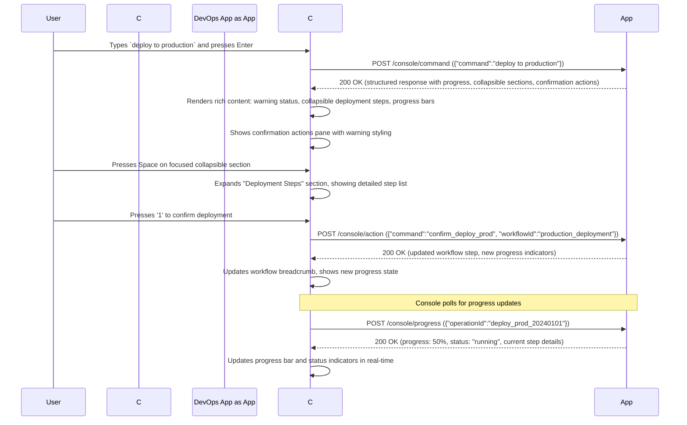
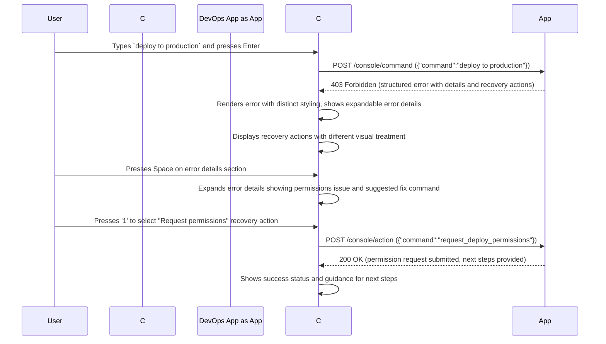
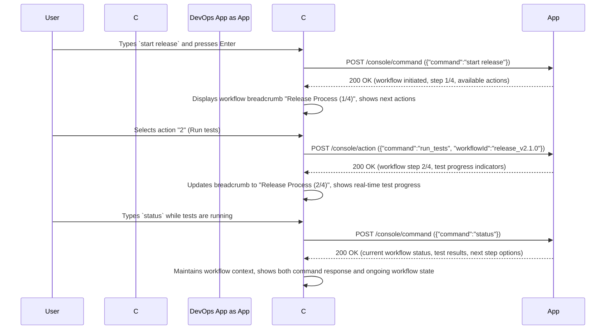

# Universal Application Console: Design Specification v2.0

## 1. Vision & Abstract

This document specifies the design for the **Universal Application Console** system. The system provides a generic, rich, terminal-based user interface (the **Console**) for interacting with any backend application that adheres to a defined communication standard (the **Compliance Protocol**).

The core paradigm is one of decoupling. The Console is analogous to a video game console; it provides a standardized controller and display. A **Compliant Application** is analogous to a game cartridge; it provides the logic and content. The user can use the same Console to "play" any Compliant Application, receiving a consistent, high-quality interactive experience regardless of the application's underlying technology.

This version incorporates advanced interface patterns for progressive disclosure, rich content rendering, workflow continuity, and enhanced user feedback mechanisms that provide a sophisticated development and interaction experience.

## 2. Core Concepts & Terminology

*   **The Console:** The client-side Terminal User Interface (TUI) application. This is a single, standalone binary written in Go. Its sole responsibility is to render the UI, manage user input, and communicate with a Compliant Application via the protocol. The Console is entirely stateless regarding application logic. It is inspired by the clean, reactive, and helpful Claude Code interface.
*   **The Compliant Application (The Application):** Any backend program, service, or script that correctly implements the Compliance Protocol. It is the "server" in the client-server relationship and the single source of truth for all application state and logic. It can be written in any language capable of running an HTTP server.
*   **The Compliance Protocol v2.0:** The rigid, versioned contract that defines how the Console and the Application communicate. It is an HTTP-based protocol utilizing JSON payloads with support for structured content, progressive disclosure, and enhanced user experience patterns. Adherence to this protocol is mandatory for an application to be considered "compliant."

## 3. Component Specification: The Console

### 3.1. Purpose and Technology Stack

*   **Purpose:** To provide a universal, interactive front-end for any compliant backend application with sophisticated content rendering and workflow management capabilities.
*   **Language:** Go
*   **Core TUI Framework:** [Bubble Tea](https://github.com/charmbracelet/bubbletea)
*   **Styling & Layout:** [Lipgloss](https://github.com/charmbracelet/lipgloss)
*   **TUI Components:** [Bubbles](https://github.com/charmbracelet/bubbles)
*   **Syntax Highlighting:** [Chroma](https://github.com/alecthomas/chroma)

### 3.2. User Interface (UI) Layout and Focus Model

The Console operates in two distinct modes: **Console Menu Mode** when no application is connected, and **Application Mode** when connected to a Compliant Application. The interface prioritizes clean, conversational flow with sophisticated content rendering and workflow management.

#### 3.2.1. Console Menu Mode

When launched without an active connection, the Console presents a registration and connection management interface.

```
+--------------------------------------------------------------------------+
| Universal Application Console v2.0                                       |
+--------------------------------------------------------------------------+
|                                                                          |
| ┌─ Registered Applications ──────────────────────────────────────────┐   |
| │ [1] PokéCLI Adventure (localhost:8080) - Ready                      │   |
| │ [2] DevOps Toolkit (localhost:9001) - Offline                       │   |
| │ [3] File Manager Pro (localhost:8082) - Ready                       │   |
| └─────────────────────────────────────────────────────────────────────┘   |
|                                                                          |
| ┌─ Quick Connect ────────────────────────────────────────────────────┐    |
| │ Host: [localhost:8080                                    ] [Connect] │    |
| └─────────────────────────────────────────────────────────────────────┘    |
|                                                                          |
| Commands: [R]egister App | [E]dit Profile | [Q]uit                       |
|                                                                          |
+--------------------------------------------------------------------------+
```

#### 3.2.2. Application Mode

When connected to a Compliant Application, the Console provides rich interaction capabilities with sophisticated content rendering.

```
+--------------------------------------------------------------------------+
| [PokéCLI Adventure v0.1.0] - Connected to localhost:8080               |
+--------------------------------------------------------------------------+
|                                                                          |
|  YOU> use master ball                                                    |
|  APP> ⚠️  Master Ball is extremely rare and guarantees capture           |
|       ▶ [Expand] Wild Charizard details                                 |
|                                                                          |
|       🔥 Wild Charizard  | LVL: 45 | HP: [██████████████████] 142/142    |
|       ⚡ Pikachu        | LVL: 35 | HP: [████████████████--] 89/95      |
|                                                                          |
|       ▼ [Collapse] Battle Effects                                       |
|         • Charizard's Fire type resists Grass moves                     |
|         • Pikachu is paralyzed (25% chance to be unable to move)        |
|         • Weather: Sunny (Fire moves +50% damage)                       |
|                                                                          |
| ┌─ Confirmation Required ──────────────────────────────────────────────┐ |
| │ [1] ✅ Use Master Ball (guaranteed capture)                           │ |
| │ [2] ❌ Cancel and choose different item                               │ |
| │ [3] 📋 View Charizard's full stats                                    │ |
| └──────────────────────────────────────────────────────────────────────┘ |
|                                                                          |
| +----------------------------------------------------------------------+ |
| | Input Box                                                            | |
| +----------------------------------------------------------------------+ |
|                                                                          |
+--------------------------------------------------------------------------+
```

#### 3.2.3. Core UI Components (Application Mode)

*   **Header:** A single, static line at the top displaying application metadata and connection status.
*   **History Pane:** The main scrolling region displaying a chronological log of commands and responses with rich content rendering.
*   **Status Indicators:** Visual markers showing operation states (pending ⏳, success ✅, error ❌, warning ⚠️).
*   **Progressive Disclosure Sections:** Collapsible content blocks that users can expand or collapse using keyboard shortcuts or focus navigation.
*   **Actions Pane:** A bordered, numbered interaction area that appears when responses include actions. Supports different visual themes for standard actions, confirmations, and error recovery.
*   **Input Component:** Enhanced text input with suggestion dropdown, command history navigation, and syntax highlighting for supported command formats.
*   **Workflow Breadcrumbs:** A context bar showing the current multi-step operation when applicable.

#### 3.2.4. Connection Management and Application Registration

The Console maintains a persistent registry of applications and their connection details, providing a centralized launch interface for all registered applications.

**Application Registration System:**
Applications can be registered through the Console Menu interface or by importing configuration profiles. Each registered application includes connection details, health status indicators, and launch preferences. The Console periodically polls registered applications to verify availability and update status indicators accordingly.

**Connection Establishment Flow:**
When launching an application, the Console displays a connection progress indicator while establishing the HTTP connection and performing the initial handshake. The interface clearly communicates connection status through visual indicators and provides descriptive error messages for connection failures, protocol mismatches, or authentication issues.

**Connection State Management:**
The Console gracefully handles connection interruptions by displaying reconnection options and maintaining command history across connection cycles. Users can return to the Console Menu at any time using meta commands, and the system preserves session context when reconnecting to previously used applications.

**Health Monitoring:**
Registered applications display real-time health status in the Console Menu, indicating whether applications are ready, offline, or experiencing issues. This monitoring helps users understand application availability before attempting connections and provides troubleshooting context for connection failures.

#### 3.2.5. Focus Navigation Model

The Console supports sophisticated keyboard navigation across all interactive elements:

*   **Tab:** Cycles forward through focusable elements (Input → Actions → Expandable Sections → Input)
*   **Shift+Tab:** Cycles backward through focusable elements
*   **Ctrl+↑/↓:** Navigate through command history in the input component
*   **Space:** Toggle expansion of focused collapsible sections
*   **Enter:** Activate focused element (execute action, toggle section, submit input)
*   **Escape:** Return focus to input component from any other focused element
*   **Numbers (1-9):** Quick execution of numbered actions when input is empty

### 3.3. Rich Content Rendering System

The Console supports structured content types that enhance readability and user understanding:

#### 3.3.1. Content Types

*   **Code Blocks:** Syntax-highlighted code with language detection and line numbers
*   **File Trees:** Hierarchical directory structures with expand/collapse functionality
*   **Tables:** Formatted tabular data with column alignment and optional sorting indicators
*   **Diffs:** Side-by-side or unified diff views for file changes
*   **Progress Indicators:** Real-time progress bars with status text and percentage completion
*   **Status Badges:** Color-coded indicators for success, failure, warning, and informational states
*   **Collapsible Sections:** Groupings of related content that can be expanded or collapsed

#### 3.3.2. Error Presentation and Recovery

Error states receive special visual treatment and include structured recovery options:

*   **Error Highlighting:** Distinct styling for error messages with clear visual separation
*   **Error Context:** Expandable sections showing detailed error information, stack traces, or logs
*   **Recovery Actions:** Specialized Actions Pane variants that suggest corrective measures
*   **Retry Mechanisms:** Built-in retry functionality for transient failures with exponential backoff indication

### 3.4. Workflow and Context Management

#### 3.4.1. Multi-Step Operations

For complex operations spanning multiple interactions, the Console maintains workflow context:

*   **Breadcrumb Navigation:** Shows current position in multi-step processes
*   **Operation Grouping:** Related commands and responses are visually grouped
*   **Context Preservation:** Maintains visual indicators of ongoing operations across multiple command cycles
*   **Workflow Progress:** Shows completion status for multi-step operations

#### 3.4.2. Confirmation and Safety Mechanisms

Critical operations require explicit confirmation through enhanced interaction patterns:

*   **Confirmation Mode:** Special Actions Pane styling for destructive or irreversible operations
*   **Impact Preview:** Detailed descriptions of operation consequences before confirmation
*   **Safety Checks:** Visual warnings and multiple confirmation steps for high-risk actions

### 3.5. Configuration and Invocation

The Console binary is invoked from the shell with enhanced configuration options.

#### Command-Line Arguments:
*   `console --host <host:port>`: Explicitly specifies the host and port of the Application to connect to. Overrides any profile setting.
*   `console --profile <profile_name>`: Connects using a predefined profile from the configuration file.
*   `console --theme <theme_name>`: Selects visual theme for syntax highlighting and UI elements.
*   `console --help`: Displays usage information and exits.
*   `console --version`: Displays the Console's version and exits.

If no arguments are provided, the Console will attempt to load a profile named `default`.

#### Configuration File:
*   **Location:** `~/.config/console/profiles.yaml` (path is OS-dependent).
*   **Format:** YAML.
*   **Structure and Example:**
    ```yaml
    # ~/.config/console/profiles.yaml
    profiles:
      default:
        host: "localhost:8080"
        theme: "monokai"
        confirmations: true
        auth:
          type: "bearer"
          token: "eyJhbGciOiJIUzI1NiIsInR5cCI6IkpXVCJ9..."
      pokemon_adventure:
        host: "localhost:9001"
        theme: "github"
        confirmations: false
        auth:
          type: "none"
    
    themes:
      monokai:
        success: "#a6e22e"
        error: "#f92672"
        warning: "#fd971f"
        info: "#66d9ef"
      github:
        success: "#28a745"
        error: "#dc3545"
        warning: "#ffc107"
        info: "#17a2b8"
    
    registered_apps:
      - name: "PokéCLI Adventure"
        profile: "pokemon_adventure"
        autoStart: false
      - name: "DevOps Toolkit"
        profile: "default"
        autoStart: false
    ```

### 3.7. Connection Management and Authentication

#### 3.7.1. Authentication Protocol

All HTTP requests to Compliant Applications MUST include authentication credentials when specified in the profile configuration. The Console supports bearer token authentication by including the Authorization header in the following format:

```
Authorization: Bearer <token_value>
```

Applications MUST validate the provided token and respond with appropriate HTTP status codes for authentication failures (401 Unauthorized) or insufficient permissions (403 Forbidden). The Console will present authentication errors with clear error messages and recovery options.

#### 3.7.2. Connection Establishment Flow

When connecting to an application, the Console follows a structured sequence to establish communication and verify compatibility:

1. **Initial Connection Attempt:** The Console displays a loading indicator with the message "Connecting to [application_name]..." while attempting to establish HTTP connectivity.

2. **Protocol Handshake:** Upon successful connection, the Console performs a GET request to `/console/spec` to retrieve application metadata and verify protocol compatibility.

3. **Authentication Verification:** If authentication is configured, the Console validates credentials during the handshake process.

4. **Connection Success:** Once handshake and authentication complete successfully, the Console transitions to Application Mode and displays the application interface.

5. **Error Handling:** Connection failures at any stage result in clear error messages with suggested recovery actions, such as checking network connectivity, verifying authentication credentials, or updating application configuration.

#### 3.7.3. Connection State Management

The Console maintains connection health through periodic heartbeat checks and graceful error recovery. When connection interruption occurs, the Console provides options to reconnect automatically, return to Console Menu, or attempt connection to alternative applications. Session state preservation ensures that command history and interface preferences persist across connection cycles.

### 3.6. Console Meta Commands

Meta commands are handled exclusively by the Console and provide enhanced control over the interface:

*   `/quit` or `/exit`: Terminates the TUI session and exits the Console application.
*   `/connect <profile_or_host>`: Disconnects from the current Application and initiates a new connection to the specified target.
*   `/clear`: Clears all text from the History Pane. Does not affect Application state.
*   `/help`: Displays a list of available meta commands and their functions in the History Pane.
*   `/theme <theme_name>`: Changes the active visual theme for the current session.
*   `/expand-all`: Expands all collapsible sections in the current history.
*   `/collapse-all`: Collapses all collapsible sections in the current history.
*   `/retry`: Repeats the last command sent to the Application.
*   `/history`: Shows command history with navigation options.

## 4. Specification: The Compliance Protocol v2.0

This protocol defines a set of HTTP endpoints that a program MUST implement to be a Compliant Application. All request and response bodies MUST be `application/json` with enhanced support for structured content and rich interactions.

---

### 4.1. Endpoint: `GET /console/spec`

*   **Purpose:** The handshake endpoint. It provides the Console with essential metadata about the Application and supported features.
*   **When Called:** Once, immediately after a successful initial connection.
*   **Request Body:** None.
*   **Success Response (200 OK):** A JSON object with the following structure.
    ```json
    {
      "appName": "PokéCLI Adventure",
      "appVersion": "0.1.0-alpha",
      "protocolVersion": "2.0",
      "features": {
        "richContent": true,
        "progressIndicators": true,
        "confirmations": true,
        "multiStep": true
      }
    }
    ```

---

### 4.2. Endpoint: `POST /console/command`

*   **Purpose:** To execute a user-typed command from the Input Component. The response supports rich content rendering and workflow management.
*   **Request Body Example:** `{"command": "use master ball"}`
*   **Success Response (200 OK) Example:**
    ```json
    {
      "response": {
        "type": "structured",
        "content": [
          {
            "type": "text",
            "content": "Master Ball is extremely rare and guarantees capture",
            "status": "warning"
          },
          {
            "type": "collapsible",
            "title": "Wild Charizard details",
            "collapsed": true,
            "content": [
              {
                "type": "table",
                "headers": ["Stat", "Value", "Notes"],
                "rows": [
                  ["Level", "45", "High level for wild encounter"],
                  ["Type", "Fire/Flying", "Resists Grass, Fighting, Fire, Steel, Bug, Fairy"],
                  ["Ability", "Blaze", "Boosts Fire moves when HP is low"],
                  ["Nature", "Adamant", "+Attack, -Special Attack"]
                ]
              }
            ]
          },
          {
            "type": "text",
            "content": "🔥 Wild Charizard  | LVL: 45 | HP: [██████████████████] 142/142",
            "status": "info"
          },
          {
            "type": "text",
            "content": "⚡ Pikachu        | LVL: 35 | HP: [████████████████--] 89/95",
            "status": "info"
          },
          {
            "type": "collapsible",
            "title": "Battle Effects",
            "collapsed": false,
            "content": [
              {
                "type": "list",
                "items": [
                  "Charizard's Fire type resists Grass moves",
                  "Pikachu is paralyzed (25% chance to be unable to move)",
                  "Weather: Sunny (Fire moves +50% damage)"
                ]
              }
            ]
          }
        ]
      },
      "actions": [
        {
          "name": "Use Master Ball (guaranteed capture)",
          "command": "confirm_master_ball_charizard",
          "type": "confirmation",
          "icon": "✅"
        },
        {
          "name": "Cancel and choose different item",
          "command": "cancel_item_use",
          "type": "cancel",
          "icon": "❌"
        },
        {
          "name": "View Charizard's full stats",
          "command": "examine_wild_charizard",
          "type": "info",
          "icon": "📋"
        }
      ],
      "workflow": {
        "id": "wild_battle_charizard",
        "step": 3,
        "totalSteps": 5,
        "title": "Wild Pokemon Battle"
      }
    }
    ```

#### 4.2.1. Response Structure Details

*   **response:** Can be a simple string (backward compatibility) or a structured object supporting rich content.
*   **actions:** Enhanced with type indicators and icons for improved visual presentation.
*   **workflow:** Optional object providing context for multi-step operations.
*   **requiresConfirmation:** Boolean flag indicating if this response requires explicit user confirmation.

#### 4.2.2. Structured Content Types

*   **text:** Plain text with optional status indicator
*   **code:** Syntax-highlighted code block with language specification
*   **table:** Tabular data with headers and alignment options
*   **tree:** Hierarchical file or directory structure
*   **diff:** File comparison with addition/deletion highlighting
*   **progress:** Progress indicator with label and completion percentage
*   **collapsible:** Expandable content section with title and nested content
*   **list:** Ordered or unordered list items
*   **separator:** Visual divider between content sections

---

### 4.3. Endpoint: `POST /console/action`

*   **Purpose:** To execute a pre-defined action chosen by the user from the Actions Pane.
*   **When Called:** When the user selects an action via number key, arrow keys + Enter, etc.
*   **Request Body Example:**
    ```json
    {
      "command": "confirm_master_ball_charizard",
      "workflowId": "wild_battle_charizard",
      "context": {
        "itemType": "master_ball",
        "targetPokemon": "charizard_wild_45"
      }
    }
    ```
*   **Success Response (200 OK):** The response format is **identical to the `/command` endpoint**, allowing rich content and workflow progression.
    ```json
    {
      "response": {
        "type": "structured",
        "content": [
          {
            "type": "text",
            "content": "You used Master Ball!",
            "status": "info"
          },
          {
            "type": "progress",
            "label": "Capturing Charizard...",
            "progress": 100,
            "status": "success"
          },
          {
            "type": "text",
            "content": "Gotcha! Charizard was caught!",
            "status": "success"
          },
          {
            "type": "collapsible",
            "title": "Charizard's Summary",
            "collapsed": false,
            "content": [
              {
                "type": "text",
                "content": "🔥 Charizard was added to your party!"
              },
              {
                "type": "text",
                "content": "Nickname: [Leave blank for 'Charizard']"
              }
            ]
          }
        ]
      },
      "actions": [
        {
          "name": "Give nickname",
          "command": "nickname_new_charizard",
          "type": "info",
          "icon": "✏️"
        },
        {
          "name": "Continue adventure",
          "command": "continue_route_exploration",
          "type": "primary",
          "icon": "➡️"
        }
      ],
      "workflow": {
        "id": "wild_battle_charizard",
        "step": 5,
        "totalSteps": 5,
        "title": "Wild Pokemon Battle - Complete"
      }
    }
    ```

---

### 4.4. Endpoint: `POST /console/suggest`

*   **Purpose:** To provide help or suggestions for a partially typed command, with enhanced context awareness.
*   **Request Body Example:**
    ```json
    {
      "current_input": "use ?",
      "context": {
        "workflowId": "wild_battle_charizard",
        "previousCommands": ["attack thunderbolt", "examine charizard"]
      }
    }
    ```
*   **Success Response (200 OK):**
    ```json
    {
      "suggestions": [
        {
          "text": "use potion",
          "description": "Restore 20 HP to selected Pokemon",
          "type": "command"
        },
        {
          "text": "use master ball",
          "description": "Guarantee capture of any wild Pokemon (very rare item)",
          "type": "command",
          "requiresConfirmation": true
        },
        {
          "text": "use ultra ball",
          "description": "High chance to capture wild Pokemon",
          "type": "command"
        }
      ]
    }
    ```

---

### 4.5. Endpoint: `POST /console/progress` (New)

*   **Purpose:** To provide real-time progress updates for long-running operations.
*   **When Called:** Periodically during operations that support progress tracking.
*   **Request Body Example:**
    ```json
    {
      "operationId": "safari_zone_encounter_20240101",
      "requestUpdate": true
    }
    ```
*   **Success Response (200 OK):**
    ```json
    {
      "progress": 75,
      "status": "running",
      "message": "Searching for rare Pokemon...",
      "details": {
        "completed": 3,
        "total": 4,
        "current": "Checking tall grass patches"
      }
    }
    ```

---

### 4.6. Endpoint: `POST /console/cancel` (New)

*   **Purpose:** To cancel ongoing operations or workflows.
*   **Request Body Example:**
    ```json
    {
      "operationId": "safari_zone_encounter_20240101",
      "workflowId": "safari_zone_exploration"
    }
    ```
*   **Success Response (200 OK):**
    ```json
    {
      "cancelled": true,
      "message": "Safari Zone exploration cancelled successfully",
      "rollbackRequired": false
    }
    ```

---

### 4.7. Enhanced Error Responses

All endpoints now support structured error responses with recovery suggestions:

**Error Response (4xx/5xx):**
```json
{
  "error": {
    "message": "Cannot use Surf: no water nearby",
    "code": "INVALID_MOVE_LOCATION",
    "details": {
      "type": "collapsible",
      "title": "Error Details",
      "content": [
        {
          "type": "text",
          "content": "Surf can only be used on water tiles or in battle"
        },
        {
          "type": "text",
          "content": "Current location: Route 1 (grass terrain)"
        }
      ]
    },
    "recoveryActions": [
      {
        "name": "View available moves",
        "command": "show_available_moves",
        "type": "info"
      },
      {
        "name": "Go to nearby water",
        "command": "navigate_to_water",
        "type": "alternative"
      }
    ]
  }
}
```

## 5. Enhanced Interaction Sequence Diagrams

### 5.1. Diagram: Rich Content and Progressive Disclosure Flow

This illustrates the enhanced interaction experience with structured content and progressive disclosure.



### 5.2. Diagram: Error Handling and Recovery Flow

This illustrates the enhanced error handling with structured recovery options.



### 5.3. Diagram: Multi-Step Workflow with Context Preservation

This demonstrates workflow continuity across multiple command interactions.



## 6. Implementation Considerations

### 6.1. Performance and Responsiveness

The enhanced Console must maintain responsiveness despite rich content rendering. Key considerations include lazy loading of collapsed sections, efficient diff algorithms for content updates, and background polling for progress updates without blocking user input.

### 6.2. Accessibility and Usability

All visual enhancements must maintain accessibility through screen readers and keyboard-only navigation. Color coding should be supplemented with symbols and text indicators. Focus management must be intuitive and predictable across all interactive elements.

### 6.3. Backward Compatibility

The Console must gracefully handle Applications implementing earlier protocol versions. Simple string responses should render correctly while enhanced features remain available for Applications supporting the full v2.0 specification.

### 6.4. Testing and Validation

The enhanced protocol requires comprehensive testing of rich content rendering, workflow state management, and error recovery flows. Applications should provide protocol compliance validation tools to ensure correct implementation of advanced features.

This enhanced design maintains the core simplicity and elegance of the original Universal Application Console while incorporating sophisticated interface patterns that provide users with the rich, interactive experience they expect from modern development tools.